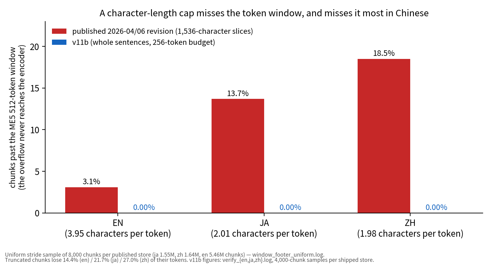
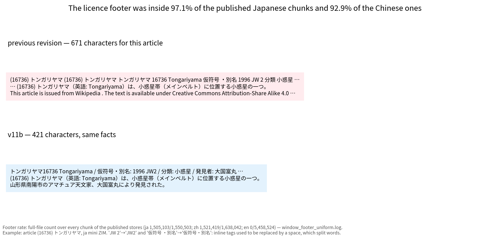
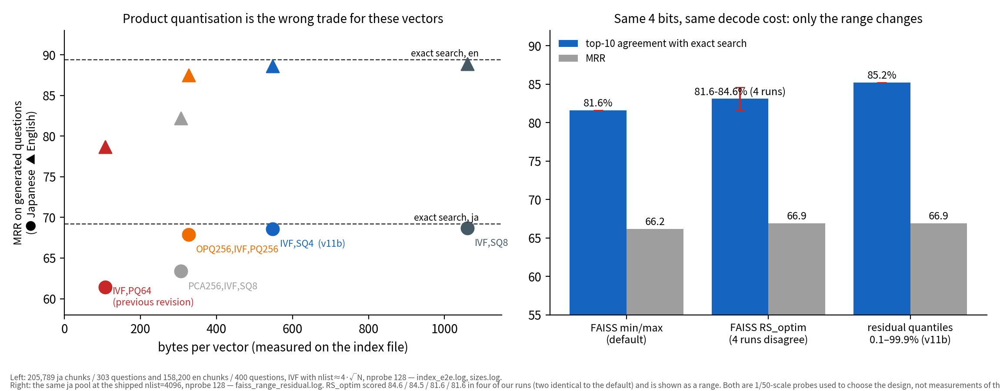

# Wikipedia index v11b — what was wrong with v1, what we changed, and what we measured

Built 2026-09-15/16 from Kiwix `*_all_mini` ZIMs (en 2026-06, zh 2026-05, ja 2026-06) with
`build_wiki_index_me5_bplus.py`. Supersedes the datasets published 2026-04 (en) and 2026-06 (ja,
zh).

Every number below names the log it comes from; the logs ship in `eval/` in each dataset repo and
in `eval/wiki_index_v11/` in this repository. Anything not backed by a log is marked unmeasured.

## The shipped artifacts

| | chunks | index (`IVF4096,SQ4`) | chunk store | offsets + gzidx | acceptance |
|---|---|---|---|---|---|
| en 2026-06 | 15,648,632 | 8.15 GB (521 B/vector) | 2.72 GB | 125 MB + 4.9 MB | PASSED |
| ja 2026-06 | 3,009,820 | 1.58 GB (526 B/vector) | 0.58 GB | 24 MB + 1.0 MB | PASSED |
| zh 2026-05 | 3,367,718 | 1.77 GB (525 B/vector) | 0.69 GB | 27 MB + 1.1 MB | PASSED |

Acceptance (`verify_wiki_index.py`, exits non-zero on failure): row count = FAISS `ntotal` =
`line_offsets.npy` length = manifest `chunk_count`; `chunk_id` unique; 0.00 % of a 4,000-chunk
random sample over the 512-token window (largest sampled chunk 257–258 tokens — 0 of 4,000 bounds
the true rate below about 0.1 %, it does not establish zero); index kind is `IVF,SQ4`. Logs:
`verify_{en,ja,zh}.log`.

## Retrieval, measured on the shipped artifacts

Questions are generated by a local Gemma-4 26B-A4B from each article's lead text, one per article,
with an instruction not to quote the title; the gold article must be recovered from the **whole
corpus**. `final_eval_{en,ja,zh}.log`.

| | recall@1 | recall@5 | MRR |
|---|---|---|---|
| en, 400 questions, nprobe 128 | 53.5 | 71.8 | 60.9 |
| ja, 303 questions, nprobe 128 | 50.8 | 63.0 | 56.3 |
| zh, 310 questions, nprobe 128 | 49.4 | 64.2 | 55.5 |

`nprobe=32` scores 58.4 / 54.6 / 55.5 MRR. The runtime default was raised to 128 for +2.5 (en) and
+1.7 (ja) MRR; **Chinese did not move** (55.5 → 55.5 MRR, recall@1 49.7 → 49.4). The extra cost
was ~0.3 ms per query on the probe pools and was not timed at shipping scale.

### Against the previously published artifact

The same generation procedure, restricted to the 296–300 gold articles present in **both** stores
(ja 300/303 and 300/303; zh 299/310 and 296/307), nprobe 128, full corpus:

| | old MRR | v11b MRR |
|---|---|---|
| ja — questions generated from the **new** extractor's text | 37.2 | 55.8 |
| **ja — questions generated from the OLD extractor's text (control)** | **26.6** | **43.3** |
| zh — questions generated from the **new** extractor's text | 33.1 | 55.2 |
| **zh — questions generated from the OLD extractor's text (control)** | **26.2** | **47.5** |

The first row of each pair favours v11b by construction: the question can only be about text the
new extractor recovered. The control row removes that advantage by generating the questions from
the old extractor's own output (`final_eval_{ja,zh}.log` block [B]); the gap narrows from +18.6 to
**+16.7** (ja) and from +22.1 to
**+21.3** (zh). Both stores score lower on the control set, because text produced by the old
extractor contains CSS and boilerplate and the questions drawn from it are noisier.

**This is an artifact-vs-artifact comparison, not an ablation.** The dump date, the extractor, the
chunker and the index type all changed at once (and the dump change favours v11b in both
languages: the Japanese comparison is a 2026-06 store against a 2026-02 one, and the Chinese a
2026-05 store against a **2025-09** one, eight months older),
and two of those can be priced separately from the same data: the index-type change actually made
(`IVF,PQ64` → `IVF,SQ4`) is worth **+7.2** MRR on a 206 k-vector ja pool (`index_e2e.log`; PQ64's
full loss against exact search is 7.8), and the new store holds 3.21 chunks per gold article
against the old store's 1.26 in Japanese, 3.08 against 1.30 in Chinese (`fix_verification.log` §F), which helps a metric that scores
article-level containment. English has no head-to-head because its previous revision came from a
different (undocumented) cleaning pass.

Two further caveats on the benchmark, both measured: the gold title appears verbatim inside the
question in 17.8 % (ja) / 12.3 % (zh) / 10.8 % (en) of the new-extractor set and 7.6 % / 6.8 % of
the control set — and every v11b chunk begins with the title line, which the old store lacks. And
27 of the 303 Japanese items (8.9 %) contain no question mark — they are declaratives lifted from
the passage; the Chinese and English sets have none.

## 1. Chunking: a character cap in front of a token window

`multilingual-e5-large` stops at 512 tokens. One token is 3.95 characters in English but **2.01 in
Japanese and 1.98 in Chinese** (measured over the published stores), so a 1,536-character slice is
a different amount of model input in each language. In the published stores, **3.1 % (en), 13.7 %
(ja) and 18.5 % (zh)** of chunks exceeded the window (uniform stride sample of 8,000 chunks per
store, `window_footer_uniform.log`); those chunks lost 14.4 / 21.7 / 27.0 % of their tokens.

The overflow is dropped at the encoder — a long passage and the same passage plus a distinct tail
produce identical `input_ids` after truncation, so their embeddings are identical — while the full
text is still stored and shown to the user as evidence. The tokenizer does emit a warning; the
embedding call does not.

v11b packs whole sentences to a **256-token budget**, with the title line's tokens reserved inside
the budget: 0.00 % of a 4,000-chunk sample over the window in every language, largest sampled
chunk 258 tokens (see the bound in the acceptance note above).

Budget sweep (`sweep_budget.log`, pools of 6,303 (ja) / 6,316 (zh) / 6,400 (en) articles, MRR): ja
79.8 (160) / **81.5 (256)** / 79.8 (360) / 78.9 (480); zh 85.7 / 84.3 / 83.0 / 82.9; en 95.6 /
92.9 / 92.8 / 92.5. A 160-token budget scored higher for English and Chinese at ~1.5× the chunk
count; 256 was chosen as the compromise across the three languages. Differences under ~2.4 points
are inside the standard error of this question set (n ≈ 300–400).

## 2. Extraction: boilerplate inside the unit of evidence

The Kiwix licence footer — "This article is issued from Wikipedia … Creative Commons
Attribution-Share Alike 4.0 …", the 184-character English licence string as it appears in the published stores (`remeasure_v2.log` §A) —
was inside **97.1 % of the published Japanese chunks (1,505,103 of 1,550,503) and 92.9 % of the
Chinese ones**, against a mean chunk length of 635 and 707 characters. The published English store
did not carry it (0 of 5,458,524): it went through a cleaning pass whose script no longer exists.

The same extractor emitted the article title two or three times (from `<head>` and `<h1>`), left
HTML entities undecoded, and replaced inline tags with a space, which split words
(`<b>Ar</b>gentino` → "Ar gentino") and injected spaces inside CJK sentences.

v11b extracts from `id="mw-content-text"`, removes the footer and navboxes **as markup**, decodes
entities, and deletes inline tags without a separator.

Infobox rows are linearised to `key: value` and kept in a **separate chunk stream** from prose.
Against mixing them into the prose chunks, the shipped split scores +2.5 MRR in English (93.3 →
95.8) and +0.5 in Japanese (80.7 → 81.2), and **−0.5 in Chinese** (84.8 → 84.3); the last two are
inside the standard error of this question set. Discarding infobox rows altogether scores
marginally higher again in English (95.9); they are kept because the runtime needs the facts, not
because retrieval asked for them (`infobox_ab_gpu1.log`).

## 3. Index type: the largest single lever

The previous revision used `IndexIVFPQ(m=64)`. On 150 k Japanese vectors at `nlist=1024`
it returned **45.4 %** (head-trained, the arm that reproduces how the published index was built) to
**47.1 %** (uniform-trained) of the exact top-10 under near-duplicate probe queries — each query is
an indexed vector plus Gaussian noise, σ = 0.02, renormalised (`pq_loss.log`); end to end on
generated questions it cost **7.8 MRR in Japanese and 10.7 in English** against exact search
(`index_e2e.log`). These vectors sit in a narrow cone — mean cosine 0.695 (en), 0.715 (ja), 0.753
(zh) over 20,000 disjoint random pairs from the whole shipped vector set of each language
(`remeasure_v2.log` §B)
— so 64-byte product-quantisation codes cannot resolve the margins that decide ranking.

| index | bytes/vector (measured) | ja MRR | en MRR |
|---|---|---|---|
| exact search (ceiling) | 4,096 | 69.2 | 89.4 |
| IVF,SQ8 | 1,060 | 68.7 | 88.9 |
| **IVF,SQ4 (v11b)** | **548** | **68.6** | **88.6** |
| OPQ256,IVF,PQ256 | 327 | 67.9 | 87.5 |
| PCA256,IVF,SQ8 | 306 | 63.4 | 82.2 |
| IVF,PQ64 (previous) | 107 | 61.4 | 78.7 |

The deficit is not intrinsic to a 64-byte budget. `OPQ64,IVF,PQ64` returns **64.3 %** of the exact
top-10 at the identical 64 bytes per vector where `IVF,PQ64` returns 47.1 % (`index_types.log`); a
learned rotation alone recovers most of the loss without the five-fold storage increase we chose.
We did not run it end to end, which is why it has no MRR row. `PCA512,IVF,SQ8` was run end to end
and loses to SQ4 at the same 512 bytes of payload (ja 65.1 / en 86.8).

SQ4 was not measurably worse than SQ8 on these pools — the difference of point estimates is 0.1
(ja) and 0.3 (en) MRR, and no paired significance test was run — while returning 87.6 % of the
exact top-10 against SQ8's 98.2 % (`index_types.log`). We chose the end-to-end metric because it
is what the runtime uses; a consumer who needs top-k set fidelity can rebuild SQ8 from the shipped
fp16 vectors in minutes. **No SQ4-vs-SQ8 comparison was run at shipping scale** (3–15.6 M vectors,
nlist 4096); the pools above are 150 k–206 k vectors, and not at one setting: `index_e2e.py` uses
`nlist = 4√N` (1,590 and 1,814), `index_types.py` and `pq_loss.py` hard-code `nlist = 1024`, the
range-fit runs use the shipped `nlist = 4096`, and `quantizer_lab.py` uses no IVF at all. The bytes/vector column is measured on those pool index files;
at shipping scale the same type measures 521–526 B/vector, because the coarse quantiser is
amortised over more vectors.

### Quantiser range: the one idea that transferred from neural texture compression

Neural texture compression wins by adapting the code allocation to the data distribution and by
compressing correlated channels together. The first of those transfers at zero cost; the second
and the neural decoder do not — an IVF scan at nprobe 128 over 15.6 M vectors touches ~490 k
vectors per query, and the quantisers that are fast are the ones whose distances are computed
without decoding.

FAISS fits the scalar quantiser's range to the min/max of the **residuals** from each coarse
centroid, which a few outliers stretch. Clipping that range to the 0.1–99.9 percentile of the
residual distribution costs nothing — same 4 bits, same LUT decode, same file format — and
measured on 205,789 ja vectors at the shipped `nlist=4096`, nprobe 128
(`faiss_range_residual.log`):

| range | top-10 agreement with exact | recall@1 | MRR |
|---|---|---|---|
| FAISS min/max (default) | 81.6 % | 62.4 | 66.2 |
| FAISS `RS_optim` | 84.6 / 84.5 / 81.6 / 81.6 % (four runs) | 63.4 or 62.4 | 66.8, 66.9, 66.2, 66.2 |
| **residual quantiles 0.1–99.9 % (v11b)** | **85.2 %** | **63.4** | **66.9** |

The `RS_optim` row is not reproducible across our own runs. Four runs on the same 205,789 vectors
recorded 84.6 % (`faiss_rangestat.log`), 84.5 % (`faiss_range_fix.log`) and 81.6 % twice
(`faiss_custom_range.log`, `faiss_range_residual.log`) — the last two scoring identically to
`RS_minmax`, which suggests the option did not take effect in those runs. We have not diagnosed
which runs are right, so `RS_optim` is an unresolved competitor to the shipped setting rather than a
number.

The gain we can demonstrate is in set fidelity. Downstream, +1.0 recall@1 and +0.7 MRR on 303
questions is four times inside this benchmark's noise scale (see Limits), and both `RS_optim` and a
1–99 percentile clip reach the same downstream figures. If what matters is the answer the runtime
returns rather than agreement with exact search, this change is not measurably worth anything
here.

Two other borrowings were measured and rejected — but on a **flat, non-IVF** SQ4 over the same
vectors, where the min/max baseline is 83.7 % rather than 81.6 % (`quantizer_lab.log`): Lloyd-Max
levels reach 87.4 % against 88.1 % for percentile clipping, and a decorrelating random rotation
84.0 %. Both were measured before we understood that the IVF quantiser encodes residuals, and
neither has been re-run in the residual setting where percentile clipping actually won; their
rejection is provisional for the same reason our first attempt was wrong. We did not measure
per-dimension variance, so we cannot say whether the rotation failed because these dimensions are
already near equal-variance or because a random rotation is the wrong rotation — a *learned*
rotation helps the PQ variants substantially. A first attempt at the clipping wrote raw-vector quantiles into the index and
made it **worse** (59.6 %), because the index encodes residuals, not raw vectors.

## 4. Build

Embedding throughput on 6,000 Japanese chunks at batch 128 (`resource_and_coverage.log` §A):

| configuration | chunks/s |
|---|---|
| GPU0, fp32 | 192.5 |
| GPU1, fp32 | 171.8 |
| both GPUs, fp32 | 294.0 |
| GPU0, fp16 | 590.9 |
| **both GPUs, fp16 (shipped)** | **889.3** |

The second GPU is worth 1.53×, fp16 is worth 3.07×, and together they are 4.62×. The shipped
English pass, which overlaps extraction with embedding across four parts, averaged **1,108
chunks/s** end to end (`logs/wiki_rebuild/build_en.log`; Japanese 1,050). fp16 is
retrieval-equivalent on this model: against fp32 on the same 3,000 texts, cosine 1.000044 mean /
0.999756 min, top-1 agreement 100 %, top-10 99.5 % (§B of the same log). Wall clock on this
machine (2× RTX 5070 Ti): zh 74 min, ja 64 min, en 295 min. All three indexes were then re-encoded from the retained fp16 vectors with
the residual-quantile range: zh 515 s, ja 406 s, en 1,268 s (`reindex_clip.log`,
`reindex_clip_en.log`).

The fp16 vectors (`emb_part*.f16`, index-aligned) stay local and are not published; they let any
other index type be rebuilt in minutes without re-embedding.

## 5. Defects found in review, and what was done

An adversarial review of the first build (three commissioned reviewers instructed to refute the
claims, all three returning NO-GO) found problems that were fixed before publication. They are
listed because the artifacts of the first build existed and the corrections are part of the
record.

| finding | action and verified effect |
|---|---|
| The navigation filter matched the keywords `編集` (also "film editing") and `解説` (also "commentary"), deleting real infobox rows | navboxes are removed as markup; keyword list deleted. Japanese `編集:` rows **106 → 21,059**, `解説:` **7 → 63**, against an unchanged 22,836 → 22,840 `撮影:` (`fix_verification.log`) |
| The CJK space rule deleted legitimate spaces; a review count put 28,188 chunks at odds with their own title line | rule removed (inline tags no longer inject spaces, so it had nothing to repair). The 28,188 figure was counted during review on the first build, whose chunk store has since been replaced; it is not reproducible from the shipped artifacts and no log of it survives |
| Sentence splitting fired on abbreviations: English chunks cut after "U.S.", "No.", "St." | splitter rejects known abbreviations and single initials. English chunks ending on one: **136,149 → 10,709** (0.87 % → 0.07 %); the remainder are sentences that genuinely end in an abbreviation |
| The infobox stream has no sentence terminators, so whole infoboxes were cut on raw token counts into fragments such as `(B-V): 0.705` | infobox rows are atomic units. Japanese chunks whose body starts mid-token: **12,670 → 2,852** |
| `chunk_id` was a 48-bit hash: at 15.6 M English chunks the birthday bound gives 0.44 expected collisions, a **35 % chance** that at least one distinct chunk was silently dropped | widened to 80 bits (expected collisions 1e-10; `misc_measure.log` §D — this is arithmetic, not a measurement) |
| Stage 2 skipped unparsable lines while advancing the counter, which would shift every later vector | now raises |
| The acceptance script could not fail, and had validated an index that was subsequently overwritten | rewritten with assertions and a non-zero exit; re-run on the shipped files |
| The build scripts were excluded from the repository by a blanket `/*.py` ignore rule | un-ignored and committed |
| No gzip seek index shipped, so a deep read had to decompress from the start of the file | `line_offsets.gzidx` now ships. Seeking to the 99th-percentile line: ja 5.7 s → 0.07 s, en 28.1 s → 0.13 s (`misc_measure.log` §B) |
| Numbers in the draft that no log supported (over-window 17.3/18.0 %, chars/token 2.33/2.06, English PQ64 loss 10.2, footer 96.1/89.9 %) | re-measured: 13.7/18.5 %, 2.01/1.98, 10.7, 97.1/92.9 % |

A second pass, this time the author auditing this document against the logs, found sixteen further
statements that the logs did not support — including a 16× overstatement of a pool size, a
misattributed index-type gain, two citations to files that did not exist, and three results
reported only in the languages where they were favourable. Thirteen of the sixteen pointed in the
flattering direction; three did not. All sixteen are listed with their corrections in
`eval/wiki_index_v11/REVIEW.md`. The same pass found that the upload staging directory was
hard-linked to the **pre-fix** builds rather than to v11b; had the upload run when it was first
staged, it would have published the artifacts this review rejected. The staging directory was
rebuilt and its file sizes re-checked against the table at the top of this document.

A third pass ran three refuters — statistics, consistency and scope — against this document. All
three returned FAILS, and one of their findings was a defect in the release rather than in the
write-up:

- **The acceptance gate had not held for two of three artifacts.** `verify_ja.log` and
  `verify_zh.log` were written at 13:25 and 14:30 on 2026-09-15; the Japanese and Chinese indexes
  were re-encoded with the residual-quantile range at 15:16 and 15:22 that afternoon. The acceptance
  evidence therefore described files that had been overwritten — verbatim the defect listed two
  paragraphs above as fixed. It recurred because this document said only English had been
  re-encoded. The script was re-run on the shipped Japanese and Chinese files on 2026-09-16 and both
  **PASSED** (`verify_ja_final.log`, `verify_zh_final.log`): the artifacts were sound, the evidence
  was missing, and the gate had not held.
- **Three measurements were wrong.** The licence-footer length was `len()` of a string hard-coded in
  the measurement script and present in no artifact (158 against an actual 184). The "narrow cone"
  figure was 2,000 pairs from the first 4,000 vectors of one embedding file with self-pairs
  admitted, not 4,000 random pairs of shipped chunks; re-measured over 20,000 disjoint random pairs
  it is 0.695 / 0.715 / 0.753. And this document stated that the Chinese dump had moved *backwards*
  — the previous Chinese store is built from the 2025-09 ZIM, so it moved forward by eight months
  and the confound runs in our favour.
- **Two results were still reported only where they were favourable**: indexed-article coverage
  (below) and the retrieval comparison against the rejected first rebuild. On the same question
  sets at nprobe 128, that rebuild scores ja 54.3, zh 54.8 and **en 62.7** against the shipped
  ja 56.3, zh 55.5 and **en 60.9** (`acceptance_full_corpus_v11a.log` against `final_eval_*.log`).
  All three moves are inside this benchmark's noise, so the round-one fixes changed retrieval
  measurably in no language; they were verified as defect counts, not as retrieval.

All three rounds are recorded in `eval/wiki_index_v11/REVIEW.md`.

## 6. Limits

- One dump per language; `all_mini` ZIMs hold lead sections, not full articles.
- The question set is synthetic, from one model, n ≈ 300–400 per language, with no human relevance
  judgements, and nothing checks that a generated question is answerable from its gold article.
  Per-question ranks were not retained, so the standard error of one MRR figure is reconstructed
  from the reported rates: **2.2–2.9 points** depending on language (`noise_floor.log`). Read "2 to
  3 points" as a rough noise scale, not a test. The title-leak and declarative-item rates above
  apply to this set.
- All index-type and quantiser numbers come from 150 k–206 k-vector pools at three different
  partition settings, not from the shipped 3–15.6 M-vector indexes. Quantisation error grows with corpus density; the direction of the
  ranking is what we rely on, not the magnitude.
- Articles whose cleaned text is under 25 characters are not indexed. Coverage rose for English
  (88.2 → 91.3 % of sampled articles) and fell slightly for Japanese (94.8 → 94.2 %) and Chinese
  (97.0 → 95.8 %).
- About 1,000 Japanese chunks (0.03 %) still have bodies containing no letters at all — reference-list
  numbering and similar fragments in the infobox stream. The fix above did not change that class
  (994 → 1,012).
- Known extraction defects that remain, quantified in the review and not fixed in this release:
  the prose/infobox split is a 60-character heuristic, and of the lines it sends to the prose stream
  because they are 60 characters or longer, **16.8 % (en), 22.9 % (ja) and 29.7 % (zh)** still read
  match a `key: value` pattern (`misc_measure.log` §C) — measured on the first 300,000 chunks in
  store order, not a random sample, and a pattern match does not by itself establish that those
  lines are misfiled;
  reference lists and a small number of MediaWiki template errors are indexed as content; the `url`
  field is not percent-encoded, so titles containing `/` produce broken links.
- No claim here is certified, peer reviewed, or independently replicated.

## Review status

Reviewed adversarially in three rounds before publication. Every reviewer was a separate model
instance, commissioned by the author and given a brief to refute rather than to assess; the
round-one reviewers' reports were not retained verbatim, so what `eval/wiki_index_v11/REVIEW.md`
records of them is the author's paraphrase, written as each finding was acted on. Round one rejected
the first rebuild. Round two found sixteen unsupported statements in this document. Round three
returned FAILS on the corrected document and found the acceptance-gate defect described in §5. Each
round found errors the previous round had introduced or passed over, which is the strongest reason
we have to expect that a fourth round would find more.

This does not meet our own standard of at least two of three **independent** judges, and no claim
here has been peer reviewed or externally validated.
